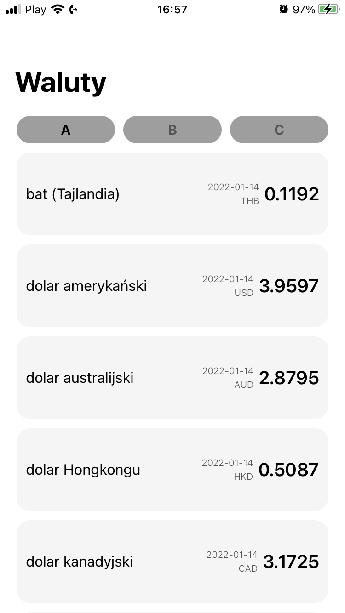
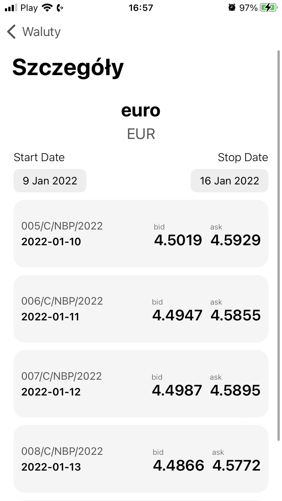
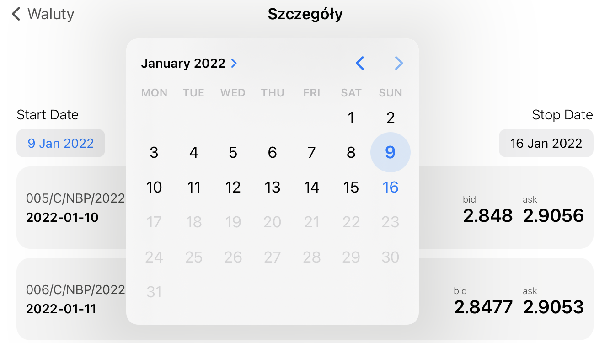

# Currency-App
Application for viewing currency value history. 
API provides 3 tables between which user can move. 
In the currency details user can set date range. 
Application can be used horizontally. 
Data fetched from NBP API (http://api.nbp.pl)

## Table of contents
* [Technologies](#Technologies)
* [Scenes_Preview](#Scenes_Preview)

## Technologies

* UIKit
* MVVM
* URLSessionDataTask

## Scenes_Preview

 

  

